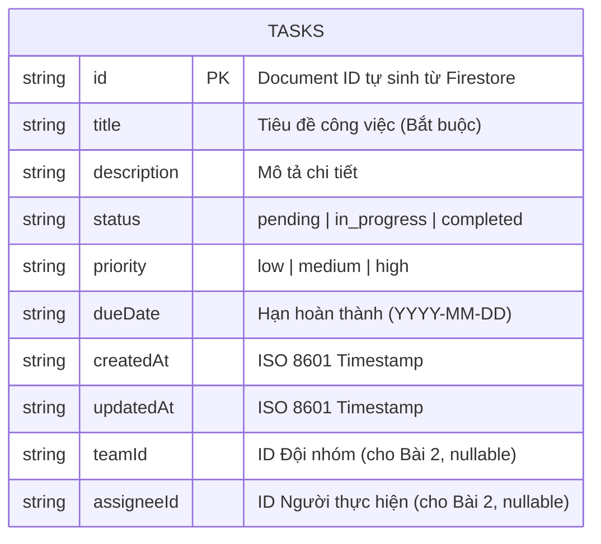

# TaskFlow - Ứng dụng Quản lý Công việc (Task Management App)

Ứng dụng di động quản lý công việc cá nhân và đội nhóm được phát triển bằng **React Native (Expo)** kết nối cơ sở dữ liệu thời gian thực **Firebase Cloud Firestore**.

---

## 🚀 Tính năng nổi bật

### 1. Quản lý công việc (CRUD)
- **Tạo mới công việc (Create):** Tiêu đề (title - bắt buộc), Mô tả (description), Trạng thái (status), Mức độ ưu tiên (priority), Hạn chót (dueDate).
- **Xem chi tiết & Danh sách (Read):** Hiển thị danh sách công việc thời gian thực (real-time `onSnapshot`).
- **Cập nhật công việc (Update):** Cho phép chỉnh sửa thông tin hoặc chuyển đổi nhanh trạng thái hoàn thành.
- **Xóa công việc (Delete):** Xóa task trực tiếp khỏi Firestore.

### 2. Điều hướng & Giao diện (Navigation & UI)
- **Bottom Navigation Tabs:** Điều hướng giữa 3 tab **Home**, **Teams** (placeholder), và **Profile**.
- **Responsive Layout:** Giao diện tối ưu cho màn hình di động, máy tính bảng và giả lập.
- **Bộ lọc trạng thái (Filter):** Lọc theo *Tất cả*, *Chờ xử lý*, *Đang làm*, *Đã xong*.
- **Pull-to-refresh:** Kéo xuống để làm mới danh sách.

### 3. Đảm bảo chất lượng (Code Quality & CI)
- **TypeScript:** Định kiểu nghiêm ngặt cho Data Models & Service.
- **ESLint & Prettier:** Chuẩn hóa code.
- **GitHub Actions CI:** Tự động kiểm tra TypeCheck & Linting mỗi khi push code lên GitHub.

---

## 🗄️ Mô hình Dữ liệu (Firestore Schema / ERD)



---

## 📁 Cấu trúc thư mục (Project Structure)

```text
Ass1_MMA/
├── .github/
│   └── workflows/
│       └── ci.yml             # GitHub Actions CI Configuration
├── src/
│   ├── components/
│   │   ├── BottomTabBar.tsx    # Thanh điều hướng Bottom Tabs
│   │   ├── EmptyState.tsx      # Trạng thái danh sách rỗng
│   │   └── TaskCard.tsx        # Card hiển thị công việc
│   ├── models/
│   ├── Task.ts            # TypeScript interfaces & enums
│   ├── navigation/
│   │   └── AppNavigator.tsx    # Navigation điều hướng chính
│   ├── screens/
│   │   ├── AddEditTaskScreen.tsx # Form Tạo / Sửa công việc
│   │   ├── HomeScreen.tsx        # Màn hình chính danh sách tasks
│   │   ├── ProfileScreen.tsx     # Tab Cá nhân (Profile)
│   │   ├── TaskDetailScreen.tsx  # Chi tiết công việc
│   │   └── TeamsScreen.tsx       # Tab Đội nhóm (Teams placeholder)
│   └── services/
│       ├── firebaseConfig.ts   # Cấu hình kết nối Firebase
│       └── taskService.ts      # Logic CRUD & real-time Firestore listener
├── .env.example                # Template biến môi trường
├── eslint.config.js            # Cấu hình ESLint 9
├── package.json
└── README.md
```

---

## 🛠️ Hướng dẫn Cài đặt & Chạy Ứng dụng

### 1. Cài đặt Dependencies
```bash
npm install
```

### 2. Cấu hình Biến Môi Trường (`.env`)
Tạo file `.env` tại thư mục gốc dự án theo mẫu:

```env
EXPO_PUBLIC_FIREBASE_API_KEY=your_api_key
EXPO_PUBLIC_FIREBASE_AUTH_DOMAIN=mma-ass.firebaseapp.com
EXPO_PUBLIC_FIREBASE_PROJECT_ID=mma-ass
EXPO_PUBLIC_FIREBASE_STORAGE_BUCKET=mma-ass.appspot.com
EXPO_PUBLIC_FIREBASE_MESSAGING_SENDER_ID=your_sender_id
EXPO_PUBLIC_FIREBASE_APP_ID=your_app_id
```

### 3. Chạy Ứng Dụng
```bash
npx expo start
```
- Nhấn `w` để chạy trên **Web Browser**.
- Quét mã QR bằng ứng dụng **Expo Go** trên điện thoại iOS / Android.

---

## 🧪 Lệnh Kiểm tra Code Quality

```bash
# Kiểm tra TypeScript Type
npm run typecheck

# Kiểm tra Linter
npm run lint

# Tự động Format Code
npm run format
```
